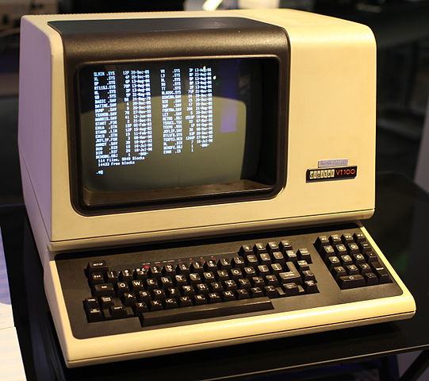

# Terminal curses

RubyKaigi 2019


Shugo Maeda

Network Applied Communication Laboratory Ltd.

## Self introduction

* Shugo Maeda
* Ruby committer
* Director at NaCl Ltd.
* Secretary General at Ruby Association

## Products

* Textbringer: Emacs-like text editor
    * 1.0.0 has been released!
* Mournmail: Message User Agent on Textbringer

## Textbringer sticker


## Terminal curses?

* terminal
    * predicted to lead to death, especially slowly;
      incurable
* curse
    * A solemn utterance intended to invoke a
      supernatural power to inflict harm or punishment
      on someone or something

(Quoted from Oxford Dictionaries)

## Topics

* Basics of terminals
* Terminal programming with Ruby
* curses and curses.gem

## Target platforms

* GNU/Linux, unless otherwise explicitly stated
* Most topics apply to other Unix-like platforms
* A few topics on Windows

## What is a terminal?



## Real text terminals

* Consist of a screen and keyboard
* Communicate with a remote computer called "the host"

## Terminal emulators

* Emulate a text terminal on a PC, etc.
* e.g., Linux console, xterm, mlterm, Windows console,
  screen, tmux, etc.

## Why use terminals?

* Highly abstract interface, which brings
    * Good operability
    * Compatibility
    * Low cost
    * Remote computing
* You look busy at work

## Interface of terminals

* User Interface
* Programming Interface

## User Interface

* Screen and keyboard

## CUI and TUI

* CUI: Character User Interface
    * CLI: Command Line Interface
    * line oriented
    * e.g., shells, line editors
* TUI: Text User Interface
    * Use the entire screen
    * e.g., screen editors

## Programming Interface

* File I/O

## STDIN, STDOUT, STDERR

```ruby
p File.readlink("/proc/self/fd/#{STDIN.fileno}")
# For FreeBSD
require 'fiddle/import'
module M
  extend Fiddle::Importer; dlload "libc.so.7"
  extern('char *fdevname(int)')
end
p "/dev/#{M.fdevname(STDIN.fileno)}"
# tty(1) is specified by POSIX
```

## Terminal devices

* /dev/tty{1..63}: virtual consoles
   * tty stands for teletypewriter
* /dev/ttyS{0..}: serial ports (serial consoles)
* /dev/pts/{0..}: pty slave devices

## Special terminal devices

* /dev/tty0: current virtual console
* /dev/tty: controlling terminal

## The controlling terminal

* Each process belongs to a process group
* Each process group belongs to a session
* Each session can have a controlling terminal

## /dev/tty

```ruby
open("/dev/tty")
# Windows has "con", which stands for console
```

## Detach the controlling terminal

```ruby
fork do
  Process.setsid
  open("/dev/tty") #=> Errno::ENXIO
end
# Or use ioctl(TIOCNOTTY)
open("/dev/tty) { |f| f.ioctl(0x5422) }
```

## Attach the controlling terminal

```ruby
# Linux
open("/dev/pts/3")
# explicit; ioctl(TIOCSCTTY)
open("/dev/pts/3") { |f| f.ioctl(0x540E, 0) } 
# steel /dev/pts/3
open("/dev/pts/3") { |f| f.ioctl(0x540E, 1) }
# FreeBSD
open("/dev/pts/3") { |f| f.ioctl(0x540E) }
```

## pty

* Pseudo terminal
* A pair of virtual devices called master & slave
    * /dev/ptmx: master clone device
    * /dev/pts/*: slave devices
* Used to implement ssh, telnet, terminal emulators, etc.
* ConPTY is available on recent Windows 10

## pty master & slave

```
+----------------+  fork/exec    +---------------+
| parent process |-------------->| child process |
+----------------+               +---------------+
        |                                |
        |                                |
+----------------+               +---------------+
|   pty master   |---------------|   pty slave   |
+----------------+               +---------------+
```

## Another use case of pty

* Fool programs
    * which change behavior when it's connected to
      a terminal
        * C's stdout is line buffered
        * Ruby prints backtrace in reverse order
        * isatty(3)/IO#tty? can be used
    * which open /dev/tty
        * get a password from the controlling termianal

## PTY

```ruby
require "pty"
master, slave = PTY.open
read, write = IO.pipe
pid = spawn("factor", in: read, out: slave)
read.close; slave.close
write.puts "42"
p master.gets # "42: 2 3 7\r\n" expected
              # but deadlock on Debian 9.3
```

## Ruby's bug?

* It works on FreeBSD 11.2 as expected
* PTY.spawn works fine on Debian 9.3

## factor.c in GNU coreutils 8.26

```c
if (line_buffered == -1)
  line_buffered = isatty (STDIN_FILENO);
```

## Reported at https://bugs.gnu.org/35046

```c
--- a/src/factor.c
+++ b/src/factor.c
@@ -2403,7 +2403,7 @@ lbuf_putc (char c)
       /* Provide immediate output for interactive input.  */
       static int line_buffered = -1;
       if (line_buffered == -1)
-        line_buffered = isatty (STDIN_FILENO);
+        line_buffered = isatty (STDOUT_FILENO);
       if (line_buffered)
         lbuf_flush ();
       else if (buffered >= FACTOR_PIPE_BUF)
```

## Merged with modification

```c
if (line_buffered == -1)
  line_buffered = isatty (STDIN_FILENO) || isatty (STDOUT_FILENO);
```

## Use cases to check standard input

```
$ factor | sed -u 's/.*: *//'
```

## Control characters

* Characters to control terminals
* Caret notification
    *  H 0b01001000 0x48
    * ^H 0b00001000 0x08
* Control character literals in Ruby
    * "\C-h" represents ^H
    * Emacs compatible

## Example

```ruby
puts "I love Perl\C-h\C-h\C-h\C-hRuby"
```

## ANSI/VT100 escape sequences

```ruby
# Move cursor
print "\e[1;1H"
# Print colored output
puts "\e[31mRed Ruby\e[0m"
```

## Sixel

* Bitmap graphics format supported by DEC terminals
* Six pixels encoded in a single ASCII character

## Example of Sixel

```ruby
print <<~EOF
\ePq
#0;2;0;0;0#1;2;100;100;0#2;2;0;100;0
#1~~@@vv@@~~@@~~$
#2??}}GG}}??}}??-
#1!14@
\e\\
EOF
```

## termcap/terminfo

* Database of terminal capabilities
* ruby-terminfo by akr

## Input processing

* canonical mode
    * line oriented
    * data are accumulated in a line editing buffer
* non-canonical mode
    * byte oriented
    * data are accumulated in a buffer with timers

## Line discipline

```
+---------+    +-----------------+    +------------+
| syscall |<-->| line discipline |<-->| tty driver |
+---------+    +-----------------|    +------------+
  read(2)             TTY                console
  write(2)            SLIP               serial
                      MOUSE              pty
                      PPP
```

## Special input characters

* ^M: carriage return
* ^J: line feed
* ^D: end of file
* ^H: backspace
* ^C: interrupt (SIGINT)
* ^\: quit (SIGQUIT)
* ^Z: suspend (SIGTSTP)
* ^S: stop output
* ^Q: restart output
* ^V: literal next character

## io/console

* Part of the Ruby standard library
* Provides additional methods for IO

## IO#noecho

```ruby
require "io/console"
password = STDIN.noecho {
  # no echo back
  STDIN.gets(chomp: true)
}
```

## IO#raw

```ruby
STDIN.raw do
  # non-canonical mode & no echo back
  # special characters are not interpreted
  p STDIN.getc
end
```

## IO.console

```ruby
f = IO.console #=> #<File:/dev/tty> or #<File:con$>
```

## curses

* Terminal control library
* Pun on "cursor optimization"
* ncurses: new curses
* ncursesw: ncurses with wide character support
* PDCurses: public domain curses
    * Windows support

## curses.gem

* Formerly part of the Ruby standard library
* I'm the original author
* Removed in Ruby 2.1
* Maintained by me and Eric Hodel

## Applications

* Textbringer: Emacs-like text editor
* rfd: filesystem explorer
* ruby_terminal_games: games
* twterm: Twitter client

## Hello world

```ruby
require "curses"
Curses.init_screen
Curses.setpos(4, 10)          # Move cursor
Curses.addstr("Hello, world") # print string
Curses.setpos(5, 10)
Curses.addstr("Press any key: ")
Curses.get_char               # Read a character
Curses.close_screen
```

## Terminal modes

```ruby
Curses.raw      # similar to STDIN.raw, but echoing and
                # CR/LF conversion are not disabled
Curses.noraw    # back to cooked mode
Curses.cbreak   # similar to Curses.raw, but
                # special characters are interpreted
Curses.nocbreak # back to cooked mode
```

## suspend/resume in raw mode

```ruby
# register signal handler for resume
trap(:CONT) do
  # Refresh screen
end
# suspend on ^Z
c = Curses.get_char
Process.kill(:STOP, 0) if c == "\C-z"
```

## Other configurations

```ruby
Curses.noecho              # no echo
Curses.nonl                # no CR/LF conversion
Curses.stdscr.keypad(true) # enable keypad
```

## Read characters

```ruby
Curses.get_char #=> "a"
Curses.get_char #=> "あ"
Curses.get_char #=> 265 (Curses::KEY_F1)
Curses.get_char #=> 410 (Curses::KEY_RESIZE on SIGWINCH)
Curses.get_char #=> nil (EOF)
```

## Alt key

* Most terminals send not "\M-a" but "\ea" by Alt-a

## Unavailable keys

* Modifiers themselves (Shift, Ctrl, Alt)
* Combinations such as Ctrl-%
    * Some terminals can be customized to send escape
      sequences for such combinations

## Non blocking read

```ruby
Curses.stdscr.nodelay = true
p Curses.get_char #=> "a"
p Curses.get_char #=> nil (no input is ready or EOF)
Curses.stdscr.timeout = 100 # ms
```

## Curses::Window

```ruby
win = Curses::Window.new(height, width, top, left)
win.box("|", "-")
win.setpos(2, 3)
win.addstr(message)
win.refresh
c = win.get_char
```

## Refresh screen

* Window#refresh
    * Update the screen
* Window#noutrefresh / Curses.doupdate
    * More efficient than Window#refresh
    * Window#noutrefresh updates the virtual screen
    * Curses.doupdate updates the physical screen

## Character width

* How to know columns needed for a character?
* Write the character and get the cursor position
    * `"\e[6n"` -> `"\e[<row>;<col>R"`
* wcwidth(3)
* unicode-display_width.gem
    * `Unicode::DisplayWidth.of("あ")`
* East Asian Ambiguous Width
    * Character widths depend on the context
* All layers should use the same width
    * Applications, curses, terminal emulators

## wcwidth(3) hacks for CJK

* LD_PRELOAD
    * https://github.com/fumiyas/wcwidth-cjk
* modified charmap
    * https://github.com/hamano/locale-eaw

## New Windows console bug?


## Windows console

* Different from others
* Dedicated API

## Console API

* High-level console I/O
    * ReadConsole()
    * WriteConsole()
* Low-level console I/O
    * ReadConsoleInput() / WriteConsoleInput()
    * ReadConsoleOutput() / WriteConsoleOutput()

## New Windows console

* WriteConsoleOutput() cannot handle fullwidth characters
* PDCurses bundled within curses.gem
  calls WriteConsoleOutput() for each character

## Menus and forms

* libmenu: menus
* libform: forms
* Not implemented in PDCurses
* Supported in curses-1.3.0

## Curses::Menu

```ruby
menu = Curses::Menu.new([
  ["Apple", "Red fruit"],
  ["Orange", "Orange fruit"],
  ["Banana", "Yellow fruit"]
])
menu.post

while ch = Curses.getch
  begin
    case ch
    when Curses::KEY_UP, ?k
      menu.up_item
    when Curses::KEY_DOWN, ?j
      menu.down_item
    else
      break
    end
  rescue Curses::RequestDeniedError
  end
end

menu.unpost
```

## Curses::Form

```ruby
fields = [
  Curses::Field.new(1, 10, 4, 18, 0, 0),
  Curses::Field.new(1, 10, 6, 18, 0, 0)
]
fields.each do |field|
  field.set_back(Curses::A_UNDERLINE)
  field.opts_off(Curses::O_AUTOSKIP)
end

form = Curses::Form.new(fields)
form.post

Curses.setpos(4, 10)
Curses.addstr("Value 1:")
Curses.setpos(6, 10)
Curses.addstr("Value 2:")

while ch = Curses.get_char
  begin
    case ch
    when Curses::KEY_F1
      break
    when Curses::KEY_DOWN
      form.driver(Curses::REQ_NEXT_FIELD)
      form.driver(Curses::REQ_END_LINE)
    when Curses::KEY_UP
      form.driver(Curses::REQ_PREV_FIELD)
      form.driver(Curses::REQ_END_LINE)
    when Curses::KEY_RIGHT
      form.driver(Curses::REQ_NEXT_CHAR)
    when Curses::KEY_LEFT
      form.driver(Curses::REQ_PREV_CHAR)
    when Curses::KEY_BACKSPACE
      form.driver(Curses::REQ_DEL_PREV)
    else
      form.driver(ch)
    end
  rescue Curses::RequestDeniedError
  end
end

form.unpost
```

## Pros and cons of menus and forms

* Pros
    * High-level interface
* Cons
    * PDCurses doesn't support menus and forms
    * Not event driven
        * curses.gem is not a framework, but a library

## Are there any TUI Frameworks?

* Textbringer

## References

* W. Richard Stevens, Stephen A. Rago
  "Advanced Programming in the UNIX Environment"
  「詳解UNIXプログラミング」

* 田中哲 (Akira Tanaka)
  「APIデザインケーススタディ」 (API Design Case Study)

## Credit

* DEC VT100 terminal at the Living Computer Museum
  https://en.wikipedia.org/wiki/Computer_terminal#/media/File:DEC_VT100_terminal.jpg
  Jason Scott
  CC BY 2.0
